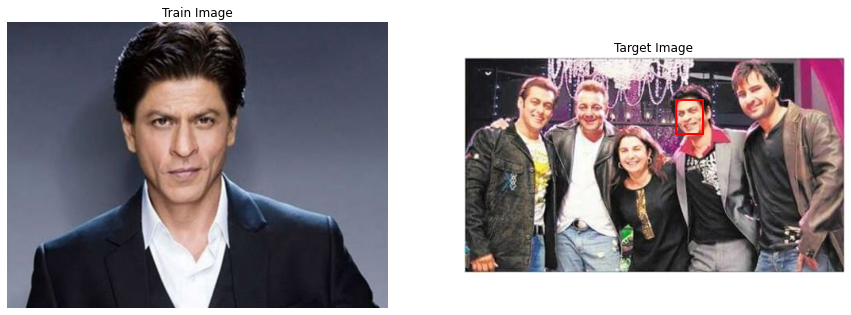
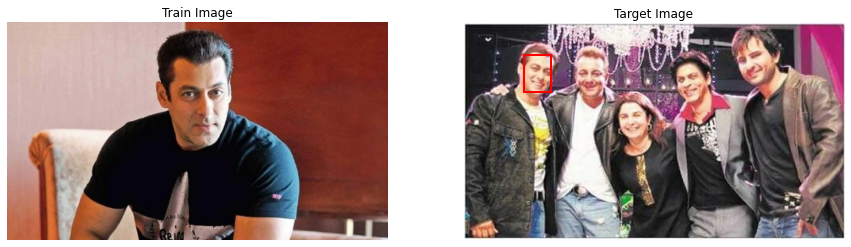

<strong><font size="5">Face Recognition using One shot Learning</font></strong><br><br>

<font size="3" color="magenta">A project which locates a person in a target image,given only 1 training image of him/her.</font>


```python
import import_ipynb
from Face_Recognition import classifier

```


```python
classifier('shahrukh.jpg','shahrukhgroup.jpg')
```


    

    


```python
classifier('salman.jpg','shahrukhgroup.jpg')
```


    

    


<br>
<br>
<br>
<br>
<br>
<br>
<br>
<br>
<br>

<font size='3'>Note</font><br><br>
<strong><font color='red'>1)Code wont work with 2.0>=tensorflow versions of tensorflow.</font></strong><br>
<strong><font color='red'>2)Keras uses tensorflow backend.</font></strong><br>
<strong><font color='red'>3)Code wont work with tensoflow gpu.</font></strong><br>
